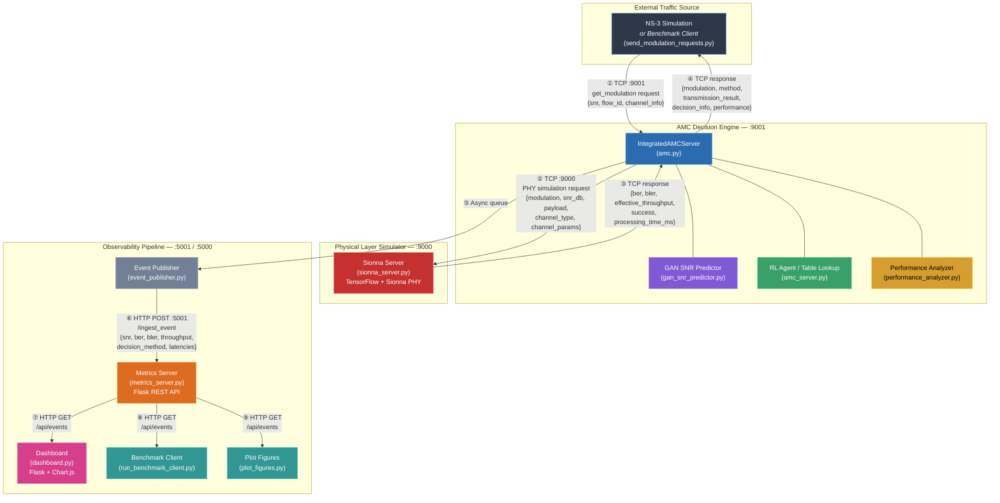
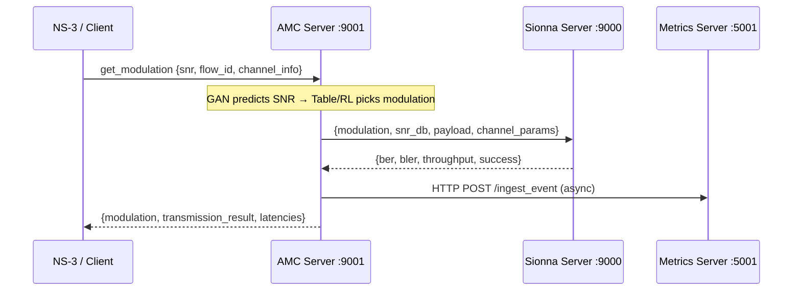
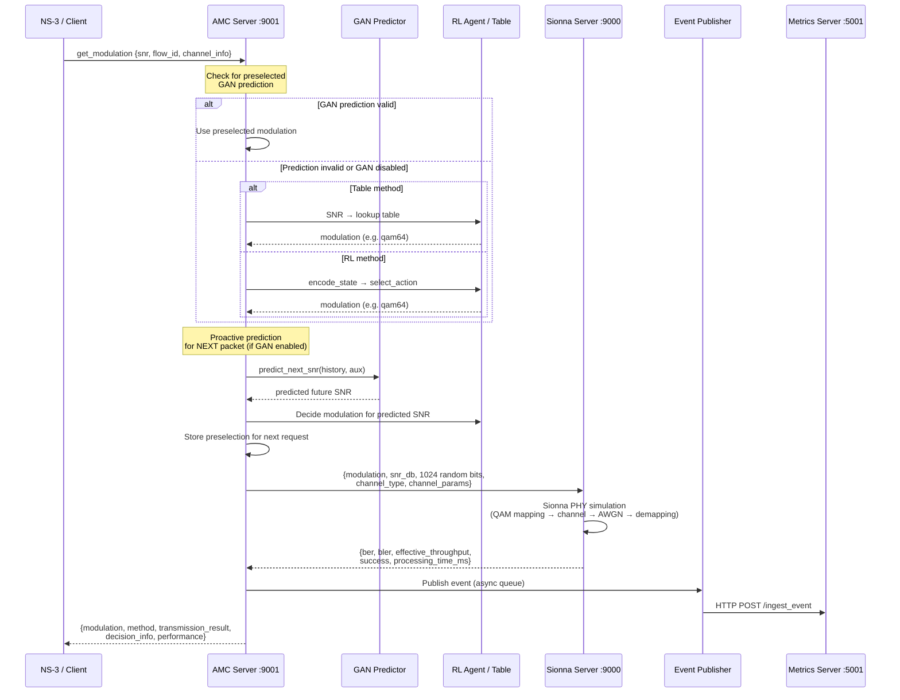
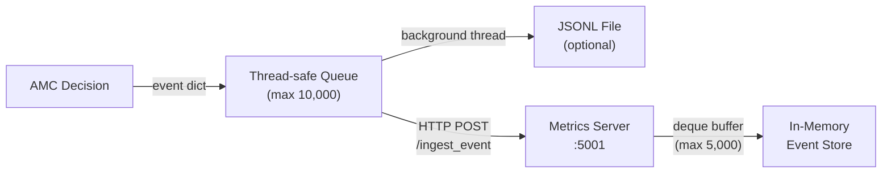
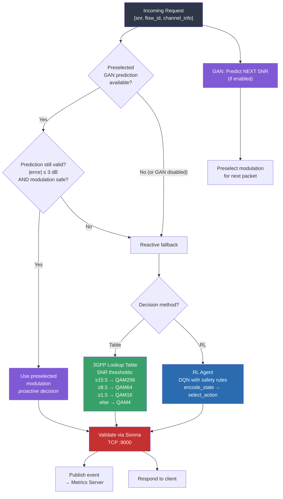

# Information Flow Diagram — Metrics Server, AMC, Sionna & NS-3

## High-Level Architecture



---

## Detailed Request-Response Flow

### ① NS-3 / Client → AMC Server (TCP :9001)

The ns-3 simulation (or test tools like `send_modulation_requests.py`) opens a raw TCP connection to the AMC server and sends a JSON request:

```json
{
  "type": "get_modulation",
  "flow_id": 1,
  "snr": 18.5,
  "channel_info": {
    "type": "rayleigh",
    "mobility_speed": 3.0,
    "distance": 100.0,
    "carrier_frequency": 2.4e9
  }
}
```

Other supported request types: `feedback` / `feedback_only`, `get_stats`.

---

### ② ③ AMC Server ↔ Sionna Server (TCP :9000)

For **every** modulation decision, the AMC server validates it by requesting a full PHY-layer simulation from Sionna:

### Simplified View



### Detailed View



**Sionna request payload:**
```json
{
  "type": "amc_server",
  "id": 1,
  "k": 1024,
  "modulation": "qam64",
  "snr_db": 18.5,
  "payload": [0, 1, 1, 0, ...],
  "channel_type": "rayleigh",
  "channel_params": {
    "carrier_frequency": 2.4e9,
    "speed": 3.0,
    "distance": 100.0,
    "num_paths": 6,
    "delay_spread": 1e-6,
    "k_factor": 10.0,
    "phase_noise_std": 0.01
  }
}
```

**Sionna response:**
```json
{
  "id": 1,
  "success": true,
  "ber": 0.000234,
  "bler": 0.031,
  "effective_throughput": 4.82,
  "modulation": "qam64",
  "channel_type": "rayleigh",
  "processing_time_ms": 28.4,
  "realistic": true
}
```

---

### ④ AMC Server → NS-3 / Client (TCP response)

The full response back to the requester:

```json
{
  "modulation": "qam64",
  "method": "integrated_gan_amc_preselected_proactive_rl_with_gan",
  "flow_id": 1,
  "decision_info": {
    "method": "preselected_proactive_rl_with_gan",
    "prediction_info": {
      "used_preselected": true,
      "predicted_snr": 19.2,
      "actual_snr": 18.5,
      "prediction_error": 0.7
    }
  },
  "transmission_result": {
    "ber": 0.000234,
    "bler": 0.031,
    "throughput": 4.82,
    "success": true
  },
  "performance": {
    "decision_latency_ms": 42.3,
    "sionna_latency_ms": 28.4,
    "gan_latency_ms": 6.1
  }
}
```

---

### ⑤ ⑥ AMC → Event Publisher → Metrics Server (HTTP :5001)

Every decision is asynchronously published via `EventPublisher`:



**Event payload:**
```json
{
  "run_id": "run-default",
  "model_mode": "integrated_gan_rl",
  "model_name": "Integrated AMC (GAN+RL)",
  "timestamp": 1716579957.42,
  "flow_id": 1,
  "snr": 18.5,
  "chosen_modulation": "qam64",
  "decision_method": "preselected_proactive_rl_with_gan",
  "prediction_error": 0.7,
  "decision_latency_ms": 42.3,
  "sionna_latency_ms": 28.4,
  "gan_latency_ms": 6.1,
  "ber": 0.000234,
  "bler": 0.031,
  "throughput": 4.82,
  "success": true
}
```

---

### ⑦ ⑧ ⑨ Consumers ← Metrics Server (HTTP GET)

| Consumer | Endpoint | Purpose |
|---|---|---|
| **Dashboard** (:5000) | `GET /api/events?window=50` | Real-time charts (Chart.js) |
| **Benchmark Client** | `GET /api/events?window=N` | Time-series snapshots & plots |
| **Plot Figures** | `GET /api/events` | Post-hoc benchmark analysis |

The Metrics Server also exposes `GET /health` for status checks.

---

## Port & Protocol Summary

| Component | Port | Protocol | Role |
|---|---|---|---|
| **Sionna Server** | `9000` | Raw TCP + JSON | PHY-layer simulation (TensorFlow/Sionna) |
| **AMC Server** | `9001` | Raw TCP + JSON | AMC decision engine (GAN + RL/Table) |
| **Metrics Server** | `5001` | HTTP REST (Flask) | Event ingestion & distribution |
| **Dashboard** | `5000` | HTTP (Flask + HTML) | Real-time visualization |

---

## Internal AMC Decision Logic


